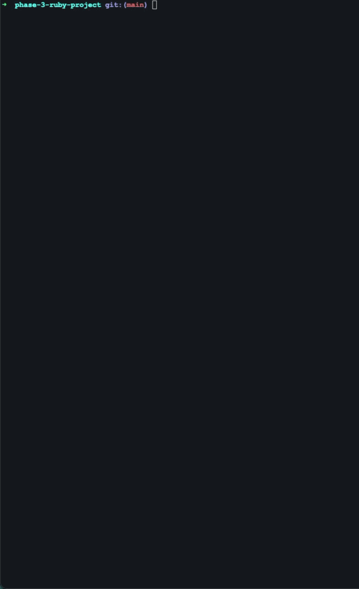

# Golf Score Tracker

## Description

Ruby project for PCA. This command-line application allows you to track golf players, courses, and rounds.

## Built With

- [Active Record](https://guides.rubyonrails.org/active_record_basics.html)
- [SQLite3](https://www.sqlite.org/index.html)
- [Colorize](https://github.com/fazibear/colorize)
- [TTY::Font](https://github.com/piotrmurach/tty-font)
- [Terminal::Table](https://github.com/tj/terminal-table)

## Demo 


## Features

- Add, list, update, and delete golf players
- Add, list, update, and delete golf courses with par values
- Log rounds by selecting a player, course, score, and date
- View all rounds for a specific player or course
- Validations to ensure score, par, and date values are valid
- Colorized output with an ASCII art welcome banner and table formatting

## Setup

### 1. Clone the repo via SSH

```bash
git clone git@github.com:BarkleyRhoat/phase-3-ruby-project.git
cd phase-3-ruby-project
```

### 2. Open in your text editor

```bash
code .
```

### 3. Install dependencies

```bash
bundle install
```

### 4. Create and migrate the database

```bash
bundle exec rake db:create
bundle exec rake db:migrate
```

### 5. Seed the database with sample data

```bash
bundle exec rake seed
```

### 6. Run the CLI

```bash
ruby cli/main.rb
```

## Domain Model

- A `Player` has many `Rounds`
- A `Course` has many `Rounds`
- A `Round` belongs to one `Player` and one `Course`

Deleting a player or course automatically deletes their associated rounds using `dependent: :destroy`.

## Useful Commands

Open a console with models loaded:

```bash
bundle exec rake console
```

Generate a new migration:

```bash
bundle exec rake db:new_migration name=create_players
```

Run the CLI:

```bash
ruby cli/main.rb
```

## Validations

- `Player.name` must be present and unique
- `Course.name` must be present and unique
- `Course.par` must be between 27 and 74
- `Round.score` must be 9 or greater
- `Round.date` cannot be in the future and must be a valid date

## Nice to Haves

- Add optional notes to each round so players can record details like weather, clubs used, or memorable shots
- Achievement badges for players based on milestones like first round logged, first round under par, 10 rounds played, and playing every course
